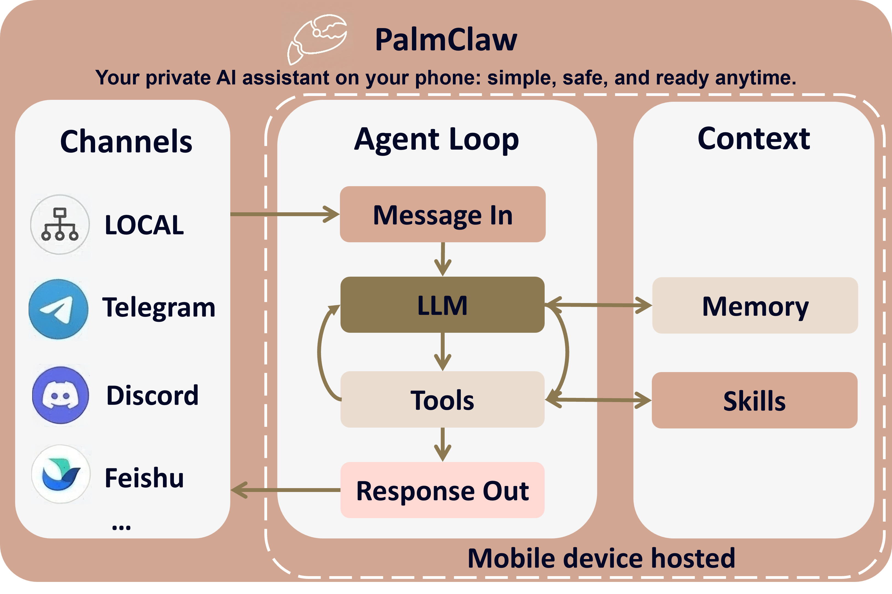

<a name="readme-top"></a>

<p align="right"><a href="./README.zh-CN.md">简体中文</a></p>

<div align="center">
  <h1>
    
    
    PalmClaw
  </h1>
  <p>Your private AI assistant on your phone: simple, safe, and ready anytime.</p>
</div>

<div align="center">
  <a href="https://modalitydance.github.io/PalmClaw/">
    
  </a>
  <a href="https://github.com/ModalityDance/PalmClaw/releases/latest/download/app-release.apk">
    
  </a>
  <a href="./docs/assets/site/weixingroup.jpg">
    
  </a>
  <a href="https://github.com/ModalityDance/PalmClaw/releases">
    
  </a>
  
  
</div>

<p align="center"><strong>⬇️ Just want to download? <a href="#quick-start-download">Jump to Quick Start</a></strong></p>

<a name="overview"></a>
## 📌 Overview

PalmClaw is a personal assistant on your phone inspired by [OpenClaw](https://github.com/openclaw/openclaw), but designed for direct mobile deployment: run your AI agent on your phone without a PC.

- 📱 Deploy and operate directly on Android.
- 🔒 Local-first runtime for a safer and more private workflow.
- ⚡ Simpler setup and daily use, while still supporting channels, tools, and automation.

<a name="key-features"></a>
## ✨ Key Features

- 📱 **Mobile-native deployment**  
  Deploy and run directly on Android, with built-in access to local hardware and files.

- ✨ **Simple workflow**  
  All operations are done directly in the app UI, making setup and usage easier.

- 🔐 **Stronger safety**  
  Android App sandbox isolation provides a naturally safer runtime boundary.

- 🧠 **Full agent stack included**  
  Memory, skills, tools, and channels are all available in one mobile runtime.


<a name="demos"></a>
## 🎬 Demos

<div align="center">
  <table width="100%">
    <tr>
      <td align="center"></td>
      <td align="center"></td>
      <td align="center"></td>
      <td align="center"></td>
    </tr>
    <tr>
      <td align="center"><sub>Initial Setup</sub></td>
      <td align="center"><sub>Core Features</sub></td>
      <td align="center"><sub>Tool Usage</sub></td>
      <td align="center"><sub>Channels Setup</sub></td>
    </tr>
  </table>
</div>


<a name="news"></a>
## 📰 News


- ✨ **[2026.04.06] v0.1.5 UI Refactor, Settings & Permissions Update:** Refined the UI and settings flow, unified permission handling, and fixed session, file, and MCP permission issues.
- ✨ **[2026.03.28] v0.1.4 Channels, UI & Auto Update:** Improved channel stability, cleaned up UI details, and added automatic update checks and downloads.
- ✨ **[2026.03.25] v0.1.3 Custom Provider & Auto-Detect Update:** Added custom provider names and improved endpoint auto-detection.
- ✨ **[2026.03.24] v0.1.2 Provider & Settings Refresh:** Added more provider presets and refined model setup and settings UX.
- 🌏 **[2026.03.21] v0.1.1 Chinese Docs & UX Update:** Added a Chinese README, improved Chinese errors, and fixed the MiniMax endpoint.
- 🚀 **[2026.03.16] Initial Release:** PalmClaw **v0.1.0** is now live! 🎉

<a name="roadmap"></a>
### 🛣️ Roadmap

- [ ] Integrate SkillHub.
  - [ ] Build a conversion skill: desktop skill -> mobile-ready skill.
- [ ] More channel integrations.
- [ ] Better tool support.
  - [ ] Stronger web search tools, like brave or tavily.
- [ ] Expand Android-native capabilities.
  - [ ] Local app integration.
  - [ ] Screen reading and interaction.
- [ ] Multimodal input and output.


<a name="table-of-contents"></a>
## 📑 Table of Contents

- [📌 Overview](#-overview)
- [✨ Key Features](#-key-features)
- [🎬 Demos](#-demos)
- [📰 News](#-news)
  - [🛣️ Roadmap](#️-roadmap)
- [📑 Table of Contents](#-table-of-contents)
- [🚀 Quick Start](#-quick-start)
  - [👤 For Normal Users](#-for-normal-users)
  - [🛠️ For Developers](#️-for-developers)
- [🔌 Channels Configuration](#-channels-configuration)
- [⚙️ How PalmClaw Works](#️-how-palmclaw-works)
- [🗂️ Repository Structure](#️-repository-structure)
- [🤝 Community](#-community)
- [⚖️ License](#️-license)

<a name="quick-start"></a>
<a name="quick-start-download"></a>
## 🚀 Quick Start

<a name="for-normal-users"></a>
### 👤 For Normal Users

1. Download the latest APK from the [Releases page](https://github.com/ModalityDance/PalmClaw/releases).
2. Install the APK on your Android phone.
3. Open PalmClaw and follow the in-app onboarding guide.
4. Finish provider setup, then start chatting in the local session!

<div align="center">
  <a href="https://github.com/ModalityDance/PalmClaw/releases/latest/download/app-release.apk">
    
  </a>
  &nbsp;&nbsp;
  <a href="./docs/assets/site/weixingroup.jpg">
    
  </a>
  <br />
  <sub>Scan to download the latest APK</sub>
  <sub>&nbsp;&nbsp;|&nbsp;&nbsp;</sub>
  <sub>Scan to join the WeChat Group</sub>
</div>

> [!IMPORTANT]
> PalmClaw does not include hosted model access by default. You need to configure your own provider API key during setup.

<a name="for-developers"></a>
### 🛠️ For Developers

1. Install Android Studio and JDK 17.
2. Clone the repository:

```bash
git clone https://github.com/ModalityDance/PalmClaw.git
cd PalmClaw
```

3. Open the project in Android Studio and wait for Gradle sync.
4. Ensure `local.properties` points to your Android SDK path.
5. Run the app on a physical device or emulator.

> [!NOTE]
> `local.properties` is machine-specific and should not be committed.

<a name="channels-configuration"></a>
## 🔌 Channels Configuration

PalmClaw currently supports these channels:

<details>
<summary><strong>Telegram</strong></summary>

1. Set `Channel = Telegram`.
2. Fill `Telegram Bot Token` and save.
3. Send one message to your bot in Telegram.
4. Tap `Detect Chats`.
5. Select detected chat, then save binding.

</details>

<details>
<summary><strong>Discord</strong></summary>

1. Set `Channel = Discord`.
2. Fill `Discord Bot Token`.
3. Set target `Discord Channel ID`.
4. Choose response mode (`mention` or `open`), optionally set allowed user IDs.
5. Save binding.

> [!TIP]
> Invite the bot to the target server/channel first.
>
> If using `mention` mode, mention the bot once to trigger replies in guild channels.

</details>

<details>
<summary><strong>Slack</strong></summary>

1. Set `Channel = Slack`.
2. Fill `Slack App Token (xapp...)` and `Slack Bot Token (xoxb...)`.
3. Set target `Slack Channel ID`.
4. Choose response mode (`mention` or `open`), optionally set allowed user IDs.
5. Save binding.

> [!IMPORTANT]
> Slack prerequisites:
>
> - Socket Mode enabled
> - App token with `connections:write`
> - Bot token with required message/reply scopes

</details>

<details>
<summary><strong>Feishu</strong></summary>

1. Set `Channel = Feishu`.
2. Fill `Feishu App ID` and `Feishu App Secret`, then save once in PalmClaw.
3. In Feishu Open Platform, make sure Bot capability is enabled. In `Events & Callbacks`, select `Long Connection`, then add `im.message.receive_v1`.
4. In `Permission Management`, add `im:message` (send messages) and `im:message.p2p_msg:readonly` (receive messages). If you test by `@`-mentioning the bot in a group, also add `im:message.group_at_msg:readonly`.
5. Publish the app, open it in Feishu, and confirm the `Long Connection` configuration while PalmClaw is still running.
6. Send one message to the bot from Feishu.
7. Tap `Detect Chats`.
8. Select detected target (`open_id` for private chat, `chat_id` for group), then save again.
9. Optional: set `Allowed Open IDs`.

> If outbound works but inbound does not, the usual cause is that the receive permission, event subscription, publish/open step, or Long Connection confirmation is still incomplete.

</details>

<details>
<summary><strong>Email</strong></summary>

1. Set `Channel = Email`.
2. Enable consent.
3. Fill IMAP settings: host, port, username, password.
4. Fill SMTP settings: host, port, username, password, from address.
5. Save once to start mailbox polling.
6. Send one email to this mailbox from target sender.
7. Tap `Detect Senders`.
8. Select sender and save again.
9. Optional: toggle auto-reply on/off.

</details>

<details>
<summary><strong>WeCom</strong></summary>

1. Set `Channel = WeCom`.
2. Fill `WeCom Bot ID` and `WeCom Secret`.
3. Save once to start long connection.
4. Send one message to the bot from WeCom.
5. Tap `Detect Chats`.
6. Select detected target and save again.
7. Optional: set `Allowed User IDs`.

</details>

> [!NOTE]
> Recommended order for any channel:
>
> 1. Open the target session.
> 2. Go to `Session Settings` -> `Channels & Configuration`.
> 3. Select channel type and follow the setup instructions.
<a name="how-palmclaw-works"></a>
## ⚙️ How PalmClaw Works

<div align="center">
  
</div>

- 📩 **Message in**: input comes from local chat or connected channels.
- 🤖 **Agent loop**: LLM decides, calls tools when needed, then generates response.
- 🧠 **Context**: memory + skills guide every turn.
- 📤 **Response out**: result is written to the session and sent back to the channels.

<a name="repository-structure"></a>
## 🗂️ Repository Structure

```text
PalmClaw/
├─ app/
│  ├─ src/main/java/com/palmclaw/
│  │  ├─ ui/                # Compose UI, settings, chat, onboarding
│  │  ├─ runtime/           # agent runtime, always-on, routing
│  │  ├─ channels/          # Telegram / Discord / Slack / Feishu / Email / WeCom
│  │  ├─ config/            # config store and storage paths
│  │  ├─ cron/              # scheduled jobs
│  │  ├─ heartbeat/         # heartbeat runtime
│  │  ├─ tools/             # mobile tools exposed to the agent
│  │  └─ skills/            # skill loading and matching
│  └─ src/main/assets/
│     ├─ templates/         # AGENT / USER / TOOLS / MEMORY / HEARTBEAT
│     └─ skills/            # bundled skills and guidance
├─ docs/assets/
│  ├─ brand/               # shared brand logos and artwork
│  ├─ site/                # docs site fonts, icons, demos, qr and diagrams
│  └─ promo/               # promotional articles and social-media resources
├─ gradle/                  # Gradle wrapper files
└─ README.md
```

<a name="community"></a>
## 🤝 Community

We welcome researchers, builders, and mobile AI practitioners to join the PalmClaw community. 🌍


<div align="center">

**Thanks to all contributors.**

<a href="https://github.com/ModalityDance/PalmClaw/contributors">
  
</a>

<br/><br/>

[](https://star-history.com/#ModalityDance/PalmClaw&Date)

</div>


<a name="license"></a>
## ⚖️ License

This project is offered under a **dual licensing model**:

- **Open Source License**: See [LICENSE](LICENSE)  
  This is the default license for the project. It ensures that any modifications made to the code, when used to provide a service over a network, must also be released under the AGPLv3.

- **Commercial License**: See [LICENSE-COMMERCIAL](./LICENSE-COMMERCIAL.md)  
  For organizations or individuals who wish to integrate this software into proprietary products or services without being bound by the AGPLv3's copyleft requirements (e.g., keeping modifications private), a commercial license is available.


<div align="center">

<a href="https://github.com/ModalityDance/PalmClaw">
  
</a>

<a href="https://github.com/ModalityDance/PalmClaw/issues">
  
</a>

<a href="https://github.com/ModalityDance/PalmClaw/discussions">
  
</a>

</div>

<div align="center">

Thanks for visiting PalmClaw! <a href="https://visitor-badge.laobi.icu">
</a>

</div>


