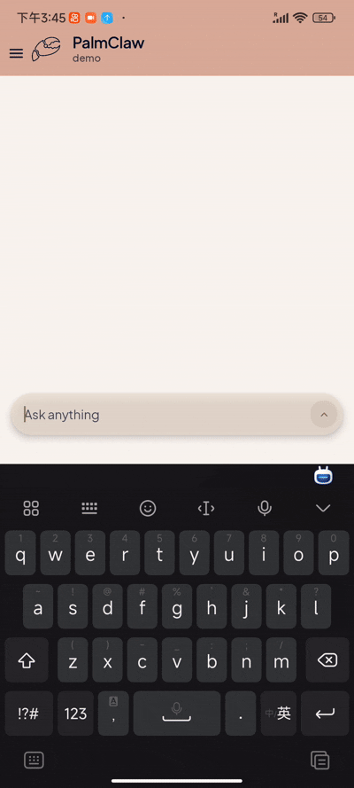
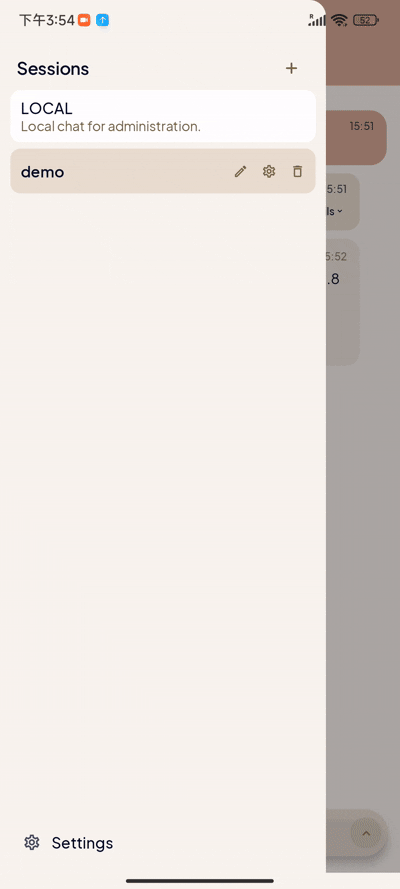

<a name="readme-top"></a>

<div align="center">
  <div style="display: inline-flex; align-items: center; gap: 14px;">
    
    <h1 style="margin: 0;">PalmClaw</h1>
  </div>
  <p>Your private AI assistant on your phone: simple, safe, and ready anytime.</p>
</div>

<div align="center">
  <a href="./docs/index.html">
    
  </a>
  
  
</div>

## Overview

PalmClaw is a personal assistant on your phone inspired by [OpenClaw](https://github.com/openclaw/openclaw), but designed for direct mobile deployment: run your AI agent on your phone without a PC.

- 📱 Deploy and operate directly on Android.
- 🔒 Local-first runtime for a safer and more private workflow.
- ⚡ Simpler setup and daily use, while still supporting channels, tools, and automation.

## Key Features

- 📱 **Mobile-native deployment**  
  Deploy and run directly on Android, with built-in access to local hardware and files.

- ✨ **Simple workflow**  
  All operations are done directly in the app UI, making setup and usage easier.

- 🔐 **Stronger safety**  
  Android App sandbox isolation provides a naturally safer runtime boundary.

- 🧠 **Full agent stack included**  
  Memory, skills, tools, and channels are all available in one mobile runtime.


## News


- **[2026.03.16]** Initial release of PalmClaw v1.0 !

### Roadmap

- [ ] Integrate SkillHub.
  - [ ] Build a conversion skill: desktop skill -> mobile-ready skill.
- [ ] More channel integrations.
- [ ] Better tool support.
  - [ ] Stronger web search tools, like brave or tavily.
- [ ] Expand Android-native capabilities.
  - [ ] Local app integration.
  - [ ] Screen reading and interaction.
- [ ] Multimodal input and output.


## Table of Contents

- [Overview](#overview)
- [Key Features](#key-features)
- [News](#news)
  - [Roadmap](#roadmap)
- [Table of Contents](#table-of-contents)
- [Demos](#demos)
- [Quick Start](#quick-start)
  - [For Normal Users](#for-normal-users)
  - [For Developers](#for-developers)
- [Channels Configuration](#channels-configuration)
- [How PalmClaw Works](#how-palmclaw-works)
- [Repository Structure](#repository-structure)
- [Community](#community)
- [License](#license)


## Demos

<div align="center">
  <table>
    <tr>
      <td align="center"></td>
      <td align="center"></td>
      <td align="center"></td>
      <td align="center"></td>
    </tr>
    <tr>
      <td align="center"><sub>Initial Setup</sub></td>
      <td align="center"><sub>Core Features</sub></td>
      <td align="center"><sub>Tool Usage</sub></td>
      <td align="center"><sub>Channels Setup</sub></td>
    </tr>
  </table>
</div>

## Quick Start

### For Normal Users

1. Download the latest APK from the [Releases page](https://github.com/ModalityDance/PalmClaw/releases) (or from the distribution link provided by the team).
2. Install the APK on your Android phone.
3. Open PalmClaw and follow the in-app onboarding guide.
4. Finish provider setup, then start chatting in the local session!

> [!IMPORTANT]
> PalmClaw does not include hosted model access by default. You need to configure your own provider API key during setup.

### For Developers

1. Install Android Studio and JDK 17.
2. Clone the repository:

```bash
git clone https://github.com/ModalityDance/PalmClaw.git
cd PalmClaw
```

3. Open the project in Android Studio and wait for Gradle sync.
4. Ensure `local.properties` points to your Android SDK path.
5. Run the app on a physical device or emulator.

> [!NOTE]
> `local.properties` is machine-specific and should not be committed.


## Channels Configuration

PalmClaw currently supports these channels:

<details>
<summary><strong>Telegram</strong></summary>

1. Set `Channel = Telegram`.
2. Fill `Telegram Bot Token` and save.
3. Send one message to your bot in Telegram.
4. Tap `Detect Chats`.
5. Select detected chat, then save binding.

</details>

<details>
<summary><strong>Discord</strong></summary>

1. Set `Channel = Discord`.
2. Fill `Discord Bot Token`.
3. Set target `Discord Channel ID`.
4. Choose response mode (`mention` or `open`), optionally set allowed user IDs.
5. Save binding.

> [!TIP]
> Invite the bot to the target server/channel first.
>
> If using `mention` mode, mention the bot once to trigger replies in guild channels.

</details>

<details>
<summary><strong>Slack</strong></summary>

1. Set `Channel = Slack`.
2. Fill `Slack App Token (xapp...)` and `Slack Bot Token (xoxb...)`.
3. Set target `Slack Channel ID`.
4. Choose response mode (`mention` or `open`), optionally set allowed user IDs.
5. Save binding.

> [!IMPORTANT]
> Slack prerequisites:
>
> - Socket Mode enabled
> - App token with `connections:write`
> - Bot token with required message/reply scopes

</details>

<details>
<summary><strong>Feishu</strong></summary>

1. Set `Channel = Feishu`.
2. Fill `Feishu App ID` and `Feishu App Secret`.
3. Save once to start long connection.
4. Send one message to the bot from Feishu.
5. Tap `Detect Chats`.
6. Select detected target (`open_id` for private chat, `chat_id` for group), then save again.
7. Optional: set `Allowed Open IDs`.

</details>

<details>
<summary><strong>Email</strong></summary>

1. Set `Channel = Email`.
2. Enable consent.
3. Fill IMAP settings: host, port, username, password.
4. Fill SMTP settings: host, port, username, password, from address.
5. Save once to start mailbox polling.
6. Send one email to this mailbox from target sender.
7. Tap `Detect Senders`.
8. Select sender and save again.
9. Optional: toggle auto-reply on/off.

</details>

<details>
<summary><strong>WeCom</strong></summary>

1. Set `Channel = WeCom`.
2. Fill `WeCom Bot ID` and `WeCom Secret`.
3. Save once to start long connection.
4. Send one message to the bot from WeCom.
5. Tap `Detect Chats`.
6. Select detected target and save again.
7. Optional: set `Allowed User IDs`.

</details>

> [!NOTE]
> Recommended order for any channel:
>
> 1. Open the target session.
> 2. Go to `Session Settings` -> `Channels & Configuration`.
> 3. Select channel type and follow the setup instructions.

> [!WARNING]
> Treat all channel tokens, bot secrets, and email credentials as sensitive secrets. Do not share them in screenshots, logs, or issue reports.


## How PalmClaw Works

<div align="center">
  
</div>

- 📩 **Message in**: input comes from local chat or connected channels.
- 🤖 **Agent loop**: LLM decides, calls tools when needed, then generates response.
- 🧠 **Context**: memory + skills guide every turn.
- 📤 **Response out**: result is written to the session and sent back to the same channel.

## Repository Structure

```text
PalmClaw/
├─ app/
│  ├─ src/main/java/com/palmclaw/
│  │  ├─ ui/                # Compose UI, settings, chat, onboarding
│  │  ├─ runtime/           # agent runtime, always-on, routing
│  │  ├─ channels/          # Telegram / Discord / Slack / Feishu / Email / WeCom
│  │  ├─ config/            # config store and storage paths
│  │  ├─ cron/              # scheduled jobs
│  │  ├─ heartbeat/         # heartbeat runtime
│  │  ├─ tools/             # mobile tools exposed to the agent
│  │  └─ skills/            # skill loading and matching
│  └─ src/main/assets/
│     ├─ templates/         # AGENT / USER / TOOLS / MEMORY / HEARTBEAT
│     └─ skills/            # bundled skills and guidance
├─ assets/                  # repository-level branding assets
├─ gradle/                  # Gradle wrapper files
└─ README.md
```

## Community

We welcome researchers, builders, and mobile AI practitioners to join the PalmClaw community.


<div align="center">

**Thanks to all contributors.**
<a href="https://github.com/ModalityDance/PalmClaw/contributors">
  
</a>

<br/><br/>

[](https://star-history.com/#ModalityDance/PalmClaw&Date)

</div>


## License

This project is licensed under the Apache License 2.0.

See:

- [LICENSE](LICENSE)
- [NOTICE](NOTICE)

<div align="center">

<a href="https://github.com/ModalityDance/PalmClaw">
  
</a>

<a href="https://github.com/ModalityDance/PalmClaw/issues">
  
</a>

<a href="https://github.com/ModalityDance/PalmClaw/discussions">
  
</a>

</div>

<p align="right">(<a href="#readme-top">back to top</a>)</p>
