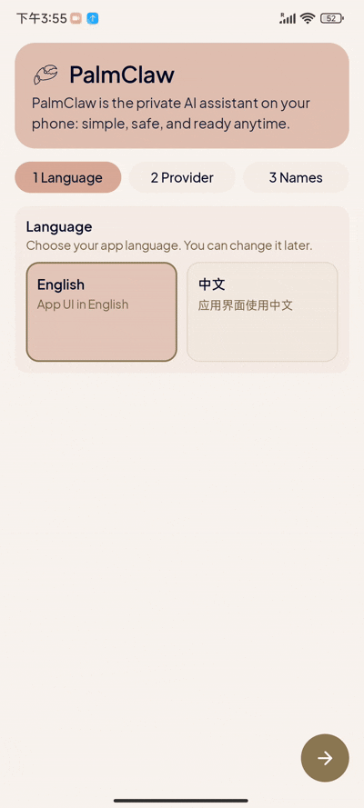
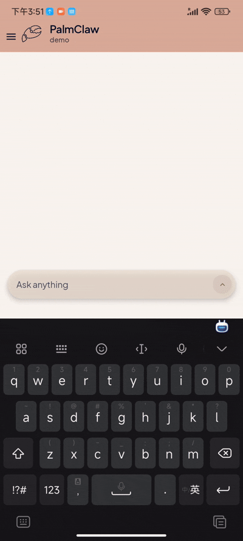
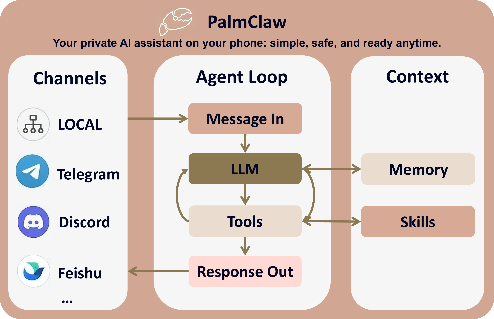

<a name="readme-top"></a>

<p align="right"><a href="./README.md">English</a></p>

<div align="center">
  <h1>
    
    
    PalmClaw
  </h1>
  <p>你手机里的私人 AI 助手：简单、安全，随时可用。</p>
</div>

<div align="center">
  <a href="https://modalitydance.github.io/PalmClaw/">
    
  </a>
  <a href="https://github.com/ModalityDance/PalmClaw/releases/latest/download/app-release.apk">
    
  </a>
  <a href="https://github.com/ModalityDance/PalmClaw/releases">
    
  </a>
  
  
</div>

<p align="center"><strong>只想直接下载？<a href="#quick-start-download">跳到快速开始</a></strong></p>

<a name="overview"></a>
## 项目简介

PalmClaw 是一款运行在手机上的个人 AI 助手，灵感来自 [OpenClaw](https://github.com/openclaw/openclaw)。它从一开始就是为移动端直接部署而设计的，你可以把 AI agent 直接跑在手机上，不需要依赖 PC。

- 可直接在 Android 上部署和运行。
- 以本地优先为核心，更安全，也更注重隐私。
- 上手和日常使用更轻量，同时保留渠道、工具和自动化能力。

<a name="key-features"></a>
## 核心特性

- **原生移动端部署**  
  直接在 Android 上部署和运行，天然可访问本地硬件与文件。

- **更简单的工作流**  
  所有操作都可以在 App UI 内完成，配置和使用都更直接。

- **更强的安全边界**  
  Android 应用沙箱隔离为运行时提供了天然更稳妥的边界。

- **完整的 agent 栈**  
  Memory、Skills、Tools、Channels 都集成在同一个移动端运行时里。


<a name="demos"></a>
## 演示

<div align="center">
  <table width="100%">
    <tr>
      <td align="center"></td>
      <td align="center"></td>
      <td align="center"></td>
      <td align="center"></td>
    </tr>
    <tr>
      <td align="center"><sub>初始配置</sub></td>
      <td align="center"><sub>核心功能</sub></td>
      <td align="center"><sub>工具使用</sub></td>
      <td align="center"><sub>渠道配置</sub></td>
    </tr>
  </table>
</div>


<a name="news"></a>
## 最新动态

- **[2026.03.21] v0.1.1 中文文档与体验更新：** 新增中文 README，补充中文错误提示，并修复 MiniMax API 端点。
- **[2026.03.16] 首次发布：** PalmClaw **v0.1.0** 已正式上线。

<a name="roadmap"></a>
### 路线图

- [ ] 集成 SkillHub。
  - [ ] 提供技能转换能力：desktop skill -> mobile-ready skill。
- [ ] 支持更多渠道。
- [ ] 完善工具能力。
  - [ ] 更强的 Web 搜索工具，例如 brave 或 tavily。
- [ ] 扩展更多 Android 原生能力。
  - [ ] 本地 App 集成。
  - [ ] 屏幕读取与交互。
- [ ] 多模态输入与输出。


<a name="table-of-contents"></a>
## 目录

- [项目简介](#项目简介)
- [核心特性](#核心特性)
- [演示](#演示)
- [最新动态](#最新动态)
  - [路线图](#路线图)
- [目录](#目录)
- [快速开始](#快速开始)
  - [普通用户](#普通用户)
  - [开发者](#开发者)
- [渠道配置](#渠道配置)
- [PalmClaw 如何工作](#palmclaw-如何工作)
- [仓库结构](#仓库结构)
- [社区](#社区)
- [许可证](#许可证)

<a name="quick-start"></a>
<a name="quick-start-download"></a>
## 快速开始

<a name="for-normal-users"></a>
### 普通用户

1. 在 [Releases 页面](https://github.com/ModalityDance/PalmClaw/releases) 下载最新 APK。
2. 在你的 Android 手机上安装 APK。
3. 打开 PalmClaw，跟随应用内的新手引导完成配置。
4. 完成 provider 设置后，就可以先从本地会话开始聊天。

<div align="center">
  <a href="https://github.com/ModalityDance/PalmClaw/releases/latest/download/app-release.apk">
    
  </a>
  <br />
  <sub>扫码下载最新 APK</sub>
</div>

> [!IMPORTANT]
> PalmClaw 默认不提供托管模型服务。首次使用时，你需要配置自己的 provider API Key。

<a name="for-developers"></a>
### 开发者

1. 安装 Android Studio 和 JDK 17。
2. 克隆仓库：

```bash
git clone https://github.com/ModalityDance/PalmClaw.git
cd PalmClaw
```

3. 用 Android Studio 打开项目，并等待 Gradle 同步完成。
4. 确认 `local.properties` 已正确指向你的 Android SDK 路径。
5. 在真机或模拟器上运行应用。

> [!NOTE]
> `local.properties` 是本机相关配置，不应提交到仓库。

<a name="channels-configuration"></a>
## 渠道配置

PalmClaw 当前支持以下渠道：

<details>
<summary><strong>Telegram</strong></summary>

1. 将 `Channel` 设置为 `Telegram`。
2. 填写 `Telegram Bot Token` 并保存。
3. 在 Telegram 里先给你的 bot 发一条消息。
4. 点击 `Detect Chats`。
5. 选择检测到的会话，然后保存绑定。

</details>

<details>
<summary><strong>Discord</strong></summary>

1. 将 `Channel` 设置为 `Discord`。
2. 填写 `Discord Bot Token`。
3. 设置目标 `Discord Channel ID`。
4. 选择回复模式（`mention` 或 `open`），如有需要可额外设置允许的用户 ID。
5. 保存绑定。

> [!TIP]
> 先把 bot 邀请到目标服务器/频道。
>
> 如果使用 `mention` 模式，需要先 @ 一次 bot，才能在 guild channel 中触发回复。

</details>

<details>
<summary><strong>Slack</strong></summary>

1. 将 `Channel` 设置为 `Slack`。
2. 填写 `Slack App Token (xapp...)` 和 `Slack Bot Token (xoxb...)`。
3. 设置目标 `Slack Channel ID`。
4. 选择回复模式（`mention` 或 `open`），如有需要可额外设置允许的用户 ID。
5. 保存绑定。

> [!IMPORTANT]
> Slack 需要先满足以下前置条件：
>
> - 已开启 Socket Mode
> - App token 具备 `connections:write`
> - Bot token 具备所需的消息/回复权限范围

</details>

<details>
<summary><strong>Feishu （飞书）</strong></summary>

1. 将 `Channel` 设置为 `Feishu`。
2. 填写 `Feishu App ID` 和 `Feishu App Secret`。
3. 先保存一次，以启动长连接。
4. 从飞书给 bot 发一条消息。
5. 点击 `Detect Chats`。
6. 选择检测到的目标（私聊用 `open_id`，群聊用 `chat_id`），然后再次保存。
7. 可选：设置 `Allowed Open IDs`。

</details>

<details>
<summary><strong>Email （邮箱）</strong></summary>

1. 将 `Channel` 设置为 `Email`。
2. 打开授权开关。
3. 填写 IMAP 设置：host、port、username、password。
4. 填写 SMTP 设置：host、port、username、password、from address。
5. 先保存一次，以启动邮箱轮询。
6. 从目标发件人向这个邮箱发送一封邮件。
7. 点击 `Detect Senders`。
8. 选择发件人后再次保存。
9. 可选：打开或关闭自动回复。

</details>

<details>
<summary><strong>WeCom （企业微信）</strong></summary>

1. 将 `Channel` 设置为 `WeCom`。
2. 填写 `WeCom Bot ID` 和 `WeCom Secret`。
3. 先保存一次，以启动长连接。
4. 从企微给 bot 发一条消息。
5. 点击 `Detect Chats`。
6. 选择检测到的目标后再次保存。
7. 可选：设置 `Allowed User IDs`。

</details>

> [!NOTE]
> 任意渠道都建议按下面的顺序来配置：
>
> 1. 先打开目标会话。
> 2. 进入 `Session Settings` -> `Channels & Configuration`。
> 3. 选择渠道类型，并按界面提示完成配置。

<a name="how-palmclaw-works"></a>
## PalmClaw 如何工作

<div align="center">
  
</div>

- **消息输入**：输入既可以来自本地聊天，也可以来自已连接的渠道。
- **Agent loop**：LLM 负责决策，需要时调用工具，然后生成回复。
- **上下文**：memory 与 skills 共同为每一轮提供引导。
- **消息输出**：结果会写回当前会话，并发送回对应渠道。

<a name="repository-structure"></a>
## 仓库结构

```text
PalmClaw/
├── app/
│   ├── src/main/java/com/palmclaw/
│   │   ├── ui/                # Compose 界面、设置、聊天与新手引导
│   │   ├── runtime/           # agent 运行时、常驻模式与路由
│   │   ├── channels/          # Telegram / Discord / Slack / Feishu / Email / WeCom
│   │   ├── config/            # 配置存储与路径管理
│   │   ├── cron/              # 定时任务
│   │   ├── heartbeat/         # heartbeat 运行时
│   │   ├── tools/             # 暴露给 agent 的移动端工具
│   │   └── skills/            # skill 加载与匹配
│   ├── src/main/assets/
│   │   ├── templates/         # AGENT / USER / TOOLS / MEMORY / HEARTBEAT
│   │   └── skills/            # 内置 skills 与说明
├── docs/assets/               # 文档站点的品牌、媒体、字体与图标资源
├── gradle/                    # Gradle Wrapper 文件
└── README.md
```

<a name="community"></a>
## 社区

欢迎研究者、开发者，以及所有关注移动端 AI 实践的朋友加入 PalmClaw 社区。


<div align="center">

**感谢所有贡献者。**

<a href="https://github.com/ModalityDance/PalmClaw/contributors">
  
</a>

<br/><br/>

[](https://star-history.com/#ModalityDance/PalmClaw&Date)

</div>


<a name="license"></a>
## 许可证

本项目采用**双许可证模式**：

- **开源许可证**：见 [LICENSE](LICENSE)  
  这是项目默认采用的许可证。它要求任何基于本项目代码进行的修改，只要被用于通过网络提供服务，也必须按照 AGPLv3 开源发布。

- **商业许可证**：见 [LICENSE-COMMERCIAL](./LICENSE-COMMERCIAL.md)  
  如果组织或个人希望将本软件集成进闭源产品或服务中，并且不受 AGPLv3 copyleft 要求约束（例如不公开修改内容），可以选择商业许可证。


<div align="center">

<a href="https://github.com/ModalityDance/PalmClaw">
  
</a>

<a href="https://github.com/ModalityDance/PalmClaw/issues">
  
</a>

<a href="https://github.com/ModalityDance/PalmClaw/discussions">
  
</a>

</div>

<div align="center">

感谢访问 PalmClaw！<a href="https://visitor-badge.laobi.icu">
</a>

</div>
